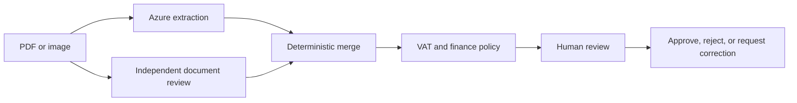

# Invoice Review

An engineering evaluation of a human-in-the-loop accounts-payable workflow for multilingual
invoices and receipts. The central design question is how to use probabilistic document
extraction without allowing model output to become accounting policy.

The application is built around a fictional Dutch facilities-management company and a safe,
generated document corpus. Azure services extract and classify evidence; deterministic Python
rules validate financial data; a reviewer remains responsible for the final decision.

## Design priorities

- **Bounded AI responsibilities.** Azure AI Document Intelligence is the primary extractor. An
  independent Azure OpenAI review may fill missing values, but it cannot overwrite conflicting
  primary values or decide whether a document is valid.
- **Deterministic financial controls.** Invoice and receipt policies are separate, inspectable
  business rules. VAT checks are local format and checksum checks, with no claim of live VIES
  registration verification.
- **Visible uncertainty.** Normalized fields retain provenance, confidence, and conflicts so the
  reviewer can distinguish extracted evidence from deterministic conclusions.
- **Human authority.** GL classification is advisory. Approval, rejection, corrections, and GL
  selection remain explicit reviewer actions.
- **Narrow infrastructure.** Provider SDKs stop at adapters, HTTP concerns stay in routes,
  orchestration stays in services, and persistence stays in repositories.

## Target workflow



The intended workflow supports one PDF, PNG, or JPEG per review, multilingual invoice and
receipt extraction, duplicate detection, deterministic validation, a constrained GL suggestion,
SQLite-backed history, and correction-email drafting without sending email.

## Evaluation corpus

The repository includes 13 fictional documents in English, Dutch, German, and French: ordinary
invoices, policy failures, a duplicate, a low-quality scan, a two-page document, and a Dutch fuel
receipt. [`samples/manifest.json`](samples/manifest.json) records expected normalized fields and
policy outcomes, making the corpus an explicit evaluation fixture rather than demo-only data.

No private invoices, customer data, or live VAT-registration claims belong in this repository.

## Technology

- Python 3.12, FastAPI, Pydantic v2, SQLAlchemy 2, and SQLite
- Azure AI Document Intelligence (`prebuilt-invoice` and `prebuilt-receipt`)
- Azure OpenAI Responses API with Entra authentication and strict structured output
- React, strict TypeScript, Vite, and Tailwind CSS
- Exact dependency pins with `uv` and `pnpm` lockfiles

## Project status

This is an active, checkpoint-based implementation and not a production accounting system. The
design and acceptance criteria are documented before each vertical slice; provider calls and the
fictional corpus are evaluated explicitly as those slices are introduced.

- [Client brief](docs/client-brief.md)
- [Architecture and trust boundaries](docs/architecture.md)
- [Implementation record and verification checkpoints](docs/build-along.md)
- [Provider usage and cost notes](docs/pricing.md)

## Local setup

Install the existing locked environments without changing dependency resolution:

```bash
cd backend
uv sync --locked

cd ../frontend
pnpm install --frozen-lockfile
```

Copy `backend/.env.example` to `backend/.env` and `frontend/.env.example` to `frontend/.env` only
when running a checkpoint that requires local configuration. Never commit credentials, uploaded
documents, generated databases, or `.env` files.

## Provenance

This public fork is used to evaluate and implement the workflow presented in Dave Ebbelaar's
[Invoice Review build](https://learn.datalumina.com/docs/invoice-review). The architectural notes,
implementation decisions, and experiments in this fork document my own assessment of that
workflow.
